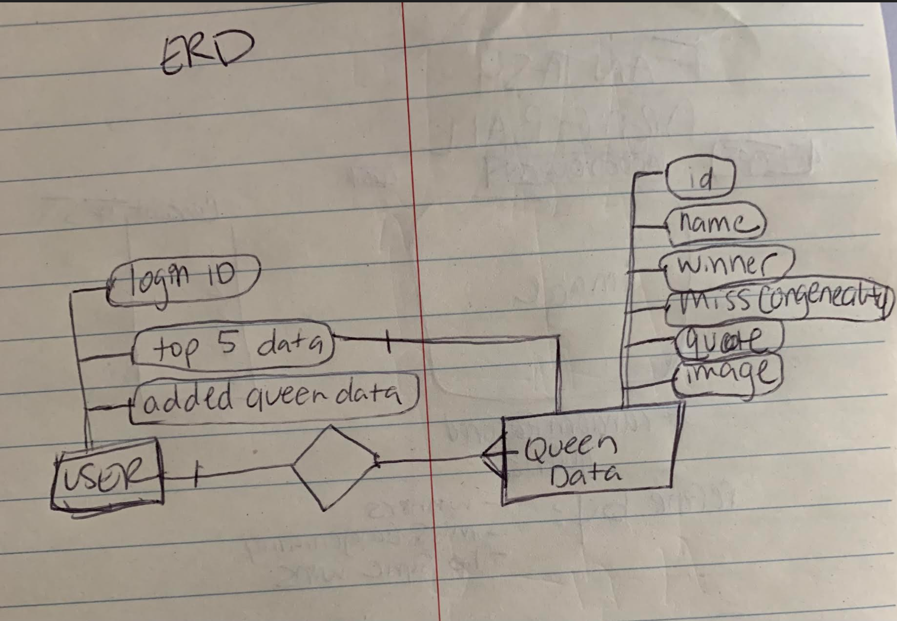
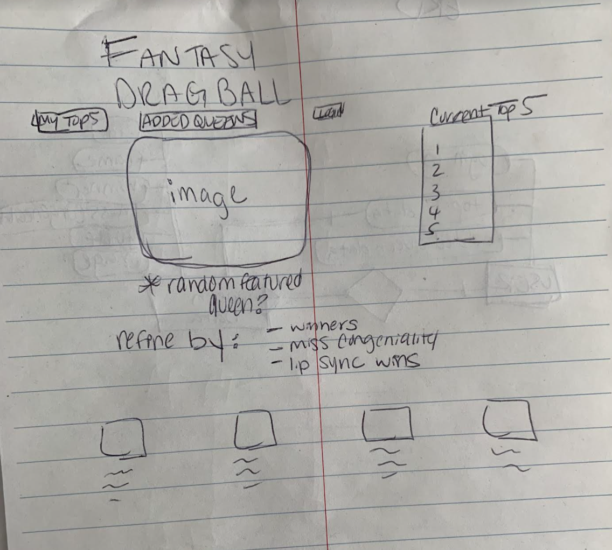

# Project 2
This is the content for project 2 (full stack-Node app)

**USER STORY**
1. As a user, they will to be able to navigate through a list of drag queens to put together a "fantasy queen-ball" team
2. As a user, they will be able to review the queens and their infromation, & add them to their top 5 list
3. As a user, they will be able to edit the queen based on their current ranking in a current season
4. As a user, there will be options to adjust rankings, remove queens from the top & add in other queens from more recent seasons, or to track local queens
5. As a user, this app will be able to be used as an individual resource or to use along with friends to compare stats and spill team
6. As a user, they will be able to create login credentials to store their top 5

**TECHNOLOGIES USED**
1. HTML
2. CSS - planning on using a CSS Framework (like Bootstrap) for enhanced visuals/interaction
3. Javascript 
4. Node 
5. Axios

**APPROACH TAKEN**
- create restful routes to be able to format an index, edit, show, and delete function
- use axios to pull in database of the queen's information/stats
- format pages in liquid js to properly display the pages

**INSTALLATION INSTRUCTIONS**
- no api key is needed on this resource (https://drag-race-api.readme.io/docs)
- env file

**UNSOLVED PROBLEMS**
- queen info is from 4 years ago, so there is a lot of missing seasons

**WIRE FRAME**
- 
- 